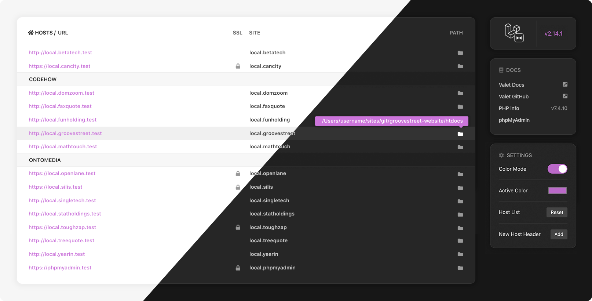

# Valet Dashboard

**Installing the dashboard**

1. Create a new Valet site for the dashboard using the files from this repo.
2. In the directory `assets/fonts`, download [Font Awesome Free](https://fontawesome.com/how-to-use/on-the-web/setup/hosting-font-awesome-yourself) and expand the ZIP file in that directory and rename it "fontawesome-free-5".
3. Duplicate file `valet.sample.sh` and rename it `valet.sh`. We'll be using this file to easily output the `valet links` table and version number for the dashboard.
4. Update the paths noted in the `valet.sh` file.
5. Then, run `valet.sh` in Terminal to populate the dashboard (e.g. $ `./valet.sh`). This step will need to be repeated every time a Valet link gets updated or changed.

**phpMyAdmin**

- Use [Homebrew](https://brew.sh/) to install phpMyAdmin: $`brew install phpmyadmin`
- Then run, `cd /usr/local/share/phpmyadmin && valet link phpmyadmin`

**Icons**

See readme in fonts directory `assets/fonts/README.md` or see step 2 above.

---

🎉 Special thanks to the folks over at **[Laravel](https://laravel.com/)** for creating **[Valet](https://laravel.com/docs/valet)!**
