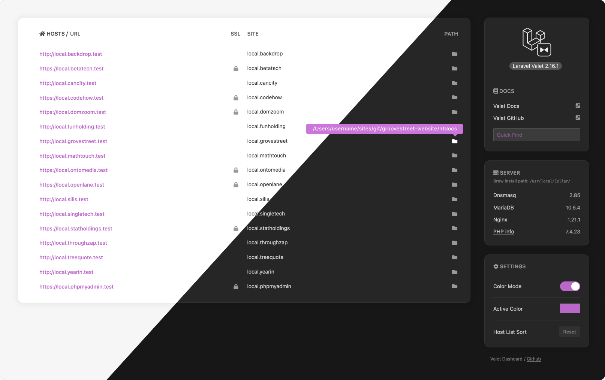

# Valet Dashboard



## Installing the dashboard

> This dashboard uses the `shell_exec()` function, which is often disabled in the `php.ini` configuration file. To enable it you need to edit the `php.ini` file, find the `disable_functions =` option and remove `shell_exec` from it.

1. Download or clone the repository to a folder of your choice.  
E.g. `https://github.com/frankyonnetti/valet-dashboard dashboard`
2. Change the directory to the newly downloaded `dashboard`.
3. Add this directory to Valet or run the `valet link` command in it.
4. Download [Font Awesome Free](https://fontawesome.com/how-to-use/on-the-web/setup/hosting-font-awesome-yourself), unzip it in the `assets/fonts` directory and rename the Font Awesome Icons directory to `fontawesome-free-5`.
Instead of the above method, you can also use the following command, execute it in the root directory where the index.php file is located.  
`git clone https://github.com/FortAwesome/Font-Awesome assets/fonts/fontawesome-free-5`
5. All that is left is to open the panel, do this using `valet open`. You can also go to http://dashboard.test.


### macOS Environments

We use PHP shell_exec() to display version numbers in the sidebar. Follow the directions in file `inc/mailhog_version.sample.php` to be sure all will display correctly.


### phpMyAdmin

- Use [Homebrew](https://brew.sh/) to install phpMyAdmin: $`brew install phpmyadmin`
- Then run, `cd /usr/local/share/phpmyadmin && valet link phpmyadmin`


### *Recommended* Set the dashboard as the default page
If you add the `default` setting to the Valet configuration file, when you go to http://localhost, the page specified in that setting will be displayed. To do this, edit the `config.json` file located in `~/.valet/` or `~/.config/valet/`.
```diff
{
+   "default": "/path/to/valet/dashboard",
    "paths": [],
    "tld": "test"
}
```

---

🎉 Special thanks to the folks over at **[Laravel](https://laravel.com/)** for creating **[Valet](https://laravel.com/docs/valet)!**
