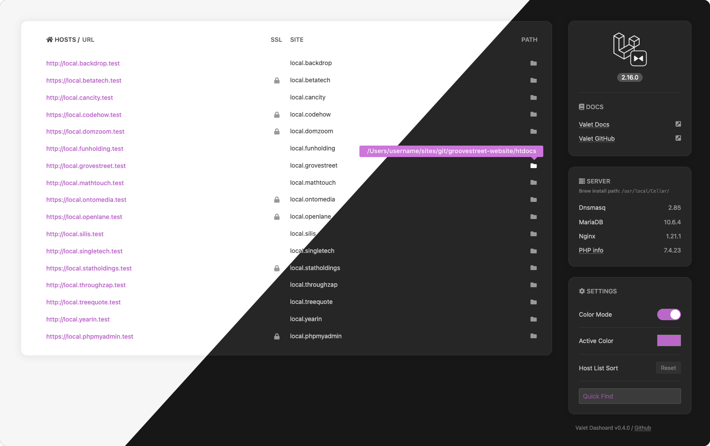

# Valet Dashboard



## Installing the dashboard

1. Download or clone the repository to a folder of your choice.
E.g. `https://github.com/frankyonnetti/valet-dashboard dashboard`
2. Change the directory to the newly downloaded `dashboard`.
3. Add this directory to Valet or run the `valet link` command in it.
4. Download [Font Awesome Free](https://fontawesome.com/how-to-use/on-the-web/setup/hosting-font-awesome-yourself), unzip it in the `assets/fonts` directory and rename the Font Awesome Icons directory to `fontawesome-free-5`.
Instead of the above method, you can also use the following command, execute it in the root directory where the index.php file is located.
`git clone https://github.com/FortAwesome/Font-Awesome assets/fonts/fontawesome-free-5`
3. Duplicate file `valet.sample.sh` and rename it `valet.sh`. We'll be using this file to easily output the `valet links` table and version number for the dashboard.
4. Change `/local/path/to/valet/dashboard` to your dashboard path in the `valet.sh` file.
5. Then, run `valet.sh` in Terminal to populate the dashboard (e.g. $ `./valet.sh`). This step will need to be repeated every time a Valet link gets updated or changed.
6. All that is left is to open the panel, do this using `valet open`. You can also go to http://dashboard.test.

### phpMyAdmin

- Use [Homebrew](https://brew.sh/) to install phpMyAdmin: $`brew install phpmyadmin`
- Then run, `cd /usr/local/share/phpmyadmin && valet link phpmyadmin`


### Icons

See readme in fonts directory `assets/fonts/README.md` or see step 2 above.


## *Recommended* Set the dashboard as the default page
If you add the `default` setting to the Valet configuration file, when you go to http://localhost, the page specified in that setting will be displayed. To do this, edit the `config.json` file located in `~/.valet/` or `~/.config/valet/`.
```diff
{
+   "default": "/path/to/valet/dashboard",
    "paths": [],
    "tld": "test"
}
```

---

🎉 Special thanks to the folks over at **[Laravel](https://laravel.com/)** for creating **[Valet](https://laravel.com/docs/valet)!**
